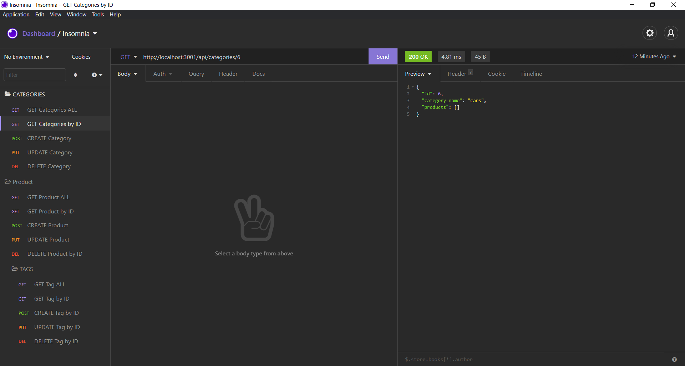

# E-Commerce-WEbsite
    
## Description
Purpose of this project was to create a backend databse for a website. This project uses express.js and sequelize to be able to process through mysql
[project link](https://github.com/lretana1/E-Commerce-Website)

## Table Of Contents
* [Installation](#user-content-installation)
* [Usage](#user-content-usage)
* [Licenses](#user-content-licenses)
* [Tests](#user-content-tests)
* [Questions](#user-content-questions)
    
## Installation
1. install MySQL2
2. install Sequelize
3. install the dotenv package
4. use the schema.sql file in the db folder to create your database using MySQL shell commands - source db/schema.sql
5. run npm run seed to seed data to your database 
6. run to following command to start the express server npm run start 
7. routes can be tested with imsomnia 
8. lastly create a .env with the following inside: 
DB_NAME="ecommerce_db"
DB_USER="root"
DB_PW="password"

## Usage
below is the walkthrough video for all routes

[how to video](images/demo.gif)
## Screenshot

## License

unlicensed
    
## Contributing
No longer looking for contributions at this time.
 
## Tests
Feel free to test as many times as youd like.

## Questions
for any questions please check out my GitHub profile: [lretana1](https://github.com/lretana1)  
